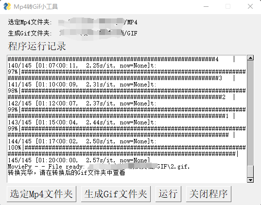
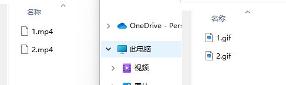

# pdf转word

## 项目环境配置

- 依赖库安装

```bash
pip install imageio[ffmpeg]
```

- 将项目添加到环境中

```bash
python addProjectEnv.py
```

## 程序执行

```bash
cd mp42gif

python mp42gifgui.py
```

- 程序界面


- 运行界面



- 转换结果



## 程序打包

```bash
pyinstaller -F .\mp42gifgui.py -w
```

如果有如下报错，请关闭防火墙后/关闭windows的实时保护后重试

```bash
win32ctypes.pywin32.pywintypes.error: (225, 'BeginUpdateResourceW', '无法成功完成操作，因为文件包含病毒或潜在的垃圾软件。')
```

打包完之后会在对应的dist目录下看到exe文件
